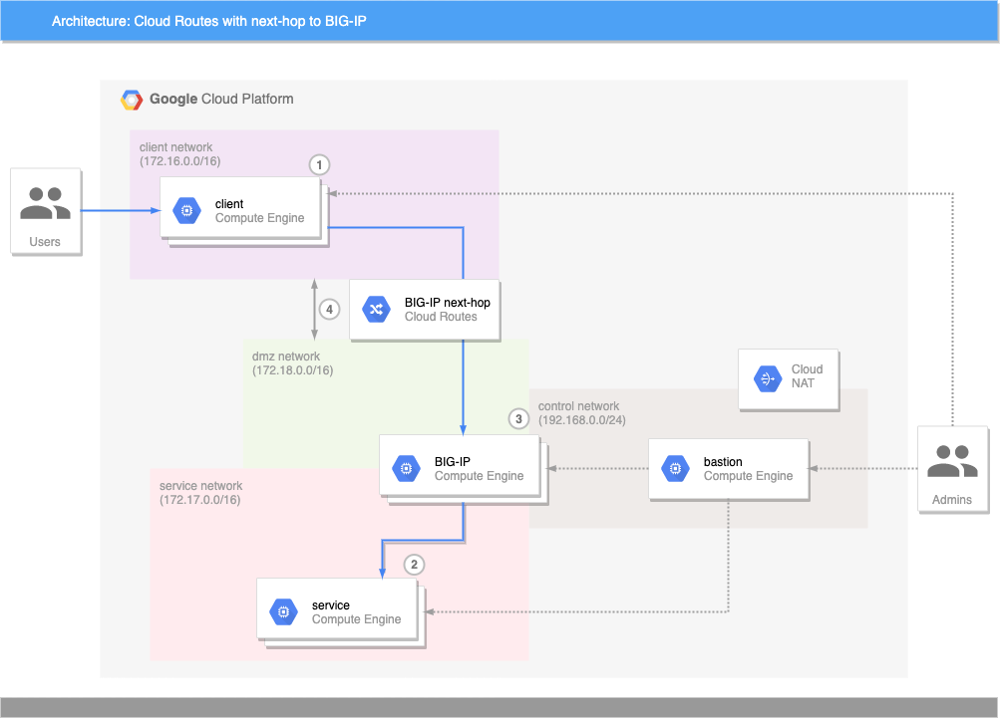

# Cloud Router and F5 BIG-IP


This repo links two multiple networks together in an approximation of
[Dedicated Interconnect](https://cloud.google.com/network-connectivity/docs/interconnect/concepts/dedicated-overview),
demonstrating how to use Routes and Cloud Router between
VPCs to use BIG-IP as the next-hop gateway.



1. Client instance
   * NGINX reverse-proxy configured to send all requests to backend instances in `172.17.0.0/16` network
   * Public IP, with FW rules to allow ingress from public internet
2. Service instances
   * NGINX hosting a static web page
   * No public IP, egress through `control` network only
3. BIG-IP instances
   * 3-NIC configuration, with interfaces in `dmz`, `control`, and `service`
   * Virtual Server defined on VIP(s) with **Service instances** as pool members
   * Forwarding rule defined on *external* interface (`dmz`)
4. `client` and `dmz` networks are connected via **VPC Peering**, with Cloud Router advertising routes
   * *client* is advertising `172.16.0.0/16` to *dmz*
   * *dmz* is advertising `172.18.0.0/16` to *client*
   * *dmz* is advertising custom route `172.17.0.0/16` with **next-hop as BIG-IP VMs**

## Setup

1. Create the networking foundations
   See [foundations](/foundations/#setup) module for example setup
2. Create/modify the Terraform environment files with required [inputs](#inputs)
3. Execute Terraform to create the BIG-IP instance and Route

   **NOTE:** due to weak module dependencies, you may need to invoke this step
   as multiple operations so that the reserved internal IP addresses are created
   before the dependent resources.

   ```shell
   terraform init -backend-config env/ENV/poc.config
   terraform apply -var-file env/ENV/poc.tfvars -auto-approve -target google_compute_address.bigip
   terraform apply -var-file env/ENV/poc.tfvars -auto-approve
   ```

   > If an error is reported that 'There is a route operation in progress on the
   > local or peer network' repeat the last `terraform apply` to complete setup.

   ```shell
   terraform apply -var-file env/ENV/poc.tfvars -auto-approve
   ```

## Testing

1. Open a browser to the public IP address of a `client` VM. The page will show
   the name of the backend `service` instance, and the *internal* IP address of
   whichever BIG-IP instance processed the request.
2. Refresh the page until you see a different BIG-IP address, prooving that GCP
   is distributing requests to all BIG-IPs.

## Clean up

1. Destroy resources via Terraform

   ```shell
   terraform destroy -var-file env/ENV/poc.tfvars -auto-approve
   ```

2. Clean up [foundational resource](foundations/#cleanup) if necessary

<!-- markdownlint-disable no-inline-html -->
<!-- BEGINNING OF PRE-COMMIT-TERRAFORM DOCS HOOK -->
## Requirements

| Name | Version |
|------|---------|
| terraform | ~> 0.12 |
| google | ~> 3.34 |
| google | ~> 3.34 |

## Providers

| Name | Version |
|------|---------|
| google | ~> 3.34 ~> 3.34 |
| google.executor | ~> 3.34 ~> 3.34 |
| random | n/a |

## Inputs

| Name | Description | Type | Default | Required |
|------|-------------|------|---------|:--------:|
| bigip\_image | The BIG-IP image to use; default is a v15.1.0.4 PAYG licensed GOOD/25MBps image. | `string` | `"projects/f5-7626-networks-public/global/images/f5-bigip-15-1-0-4-0-0-6-payg-good-25mbps-200618231522"` | no |
| bigip\_sa | The fully-qualified email address of BIG-IP service account. | `string` | n/a | yes |
| client\_sa | The fully-qualified email address of client VMs service account. | `string` | n/a | yes |
| client\_subnet | A self-link for the client subnet that will host client VMs that will<br>communicate with service VMs through BIG-IP as an advertised next-hop. | `string` | n/a | yes |
| control\_subnet | A self-link for the control subnet that will host BIG-IP, client, and service<br>management interfaces. | `string` | n/a | yes |
| dmz\_subnet | A self-link for the DMZ subnet that will host BIG-IP external interface. | `string` | n/a | yes |
| nonce | A nonce to uniquely identify the resources created. | `string` | `"cloud-route-poc"` | no |
| num\_bigips | The number of BIG-IP instances to create. Default is 2. | `number` | `2` | no |
| num\_clients | The number of client instances to create. Default is 1. | `number` | `1` | no |
| num\_services | The number of service instances to create. Default is 2. | `number` | `2` | no |
| project\_id | The existing project id that will host the resources. E.g.<br>project\_id = "example-project-id" | `string` | n/a | yes |
| service\_sa | The fully-qualified email address of service VMs service account. | `string` | n/a | yes |
| service\_subnet | A self-link for the service subnet that will host BIG-IP internal interface, and<br>service VMs. | `string` | n/a | yes |
| tf\_sa\_email | The fully-qualified email address of the Terraform service account to use for<br>resource creation. E.g.<br>tf\_sa\_email = "terraform@PROJECT\_ID.iam.gserviceaccount.com" | `string` | n/a | yes |
| tf\_sa\_token\_lifetime\_secs | The expiration duration for the service account token, in seconds. This value<br>should be high enough to prevent token timeout issues during resource creation,<br>but short enough that the token is useless replayed later. Default value is 1200. | `number` | `1200` | no |
| zone | The zone to use for BIG-IP and other resources. Default is 'us-central1-f'. | `string` | `"us-central1-f"` | no |

## Outputs

| Name | Description |
|------|-------------|
| bigip\_control\_plane\_ips | The collective set of IP addresses that are assigned to BIG-IP instances<br>attached to the control-plane subnet. |
| client\_public\_ips | The public IP addresses for the client instances. |

<!-- END OF PRE-COMMIT-TERRAFORM DOCS HOOK -->
<!-- markdownlint-enable no-inline-html -->
